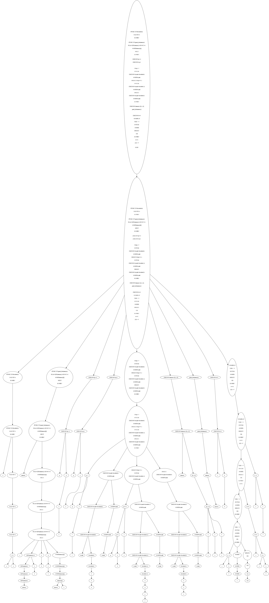

# "Szprajch" – język umożliwiający komunikację Ślązaków z komputerem

## Autorzy  
Paweł Adamczyk, Mikołaj Dudkiewicz  

<details>
  <summary>Dane kontaktowe — kliknij, aby rozwinąć</summary>
  Email: 
        <br>adamczyk@student.agh.edu.pl
        <br>mdudkiewicz@student.agh.edu.pl
</details>

---

## 📌 Założenia projektu

- **Cel:** Stworzenie interpretera własnego języka programowania (inspirowanego językiem śląskim), którego składnia opiera się na BASIC-u.  
- **Rodzaj translatora:** Interpreter (bez kompilacji do kodu pośredniego).  
- **Wynik działania programu:** Bezpośrednie wykonanie kodu źródłowego (interaktywnie lub wczytując plik).  

---

## 🧰 Technologie

- **Język implementacji:** Python  
- **Generator skanerów/parserów:** ANTLR v4  
- **Wizualizacja AST:** `graphviz`

---

## 🧱 Tokeny (SzprajchTokens.g4)

```antlr
// Operatory
MUL : '*' ;
DIV : '/' ;
ADD : '+' ;
SUB : '-' ;
EXP : '^' ;
MOD : 'MOD' ;

// Operatory logiczne
NEQ : '<>' ;
GTE : '>=' ;
LTE : '<=' ;
GT  : '>' ;
LT  : '<' ;
EQ  : '=' ;

// Operatory relacyjne
AND : 'I' ;
OR  : 'ALBO' ;
NOT : 'NIY' ;

// Inne
COMMA  : ',' ;
LPAREN : '(' ;
RPAREN : ')' ;
LBRACKET : '['; 
RBRACKET : ']' ;

// Funkcje
LEN : 'LEN' | 'len' ;
VAL : 'VAL' | 'val' ;
ISNAN : 'ISNAN' | 'isnan' ;

// Słowa kluczowe
PRINT     : 'GODEJ' | 'godej' ;
INPUT     : 'WKLUDZ' | 'wkludz' ;
LET       : 'ZMIYNNO' ;
REM       : 'GODKA' ;
IF        : 'JAK' ;
THEN      : 'POTYM' ;
ELSE      : 'INKSZY' ;
END       : 'KONIEC' ;
FUNCTION  : 'FUNKCYJO' ;
RETURN    : 'NAZOT' ;
FOR       : 'DLA' ;
WHILE     : 'PÓKI' ;
REPEAT    : 'CIOMPLOJ' | 'cimploj' ;
UNTIL     : 'AŻ' ;
STEP      : 'CO' ;
NEXT      : 'NEXT' | 'next' ;
TO        : 'DO' ;
CONTINUE  : 'CIŚ' ;
BREAK     : 'STOPNIJ' ;

// Komentarze
COMMENT : REM ~[\r\n]* -> skip ;

// Literały
ID              : [a-zA-Z_][a-zA-Z0-9_]* ;
NUMBER          : [0-9]+ ('.' [0-9]+)? ;
STRINGLITERAL   : '"' ~["\r\n]* '"' ;
DOLLAR          : '$' ;
NEWLINE         : '\r'? '\n' ;
WS              : [ \t]+ -> skip ;


Pełna gramatyka znajduje się w plikach `Szprajch/*.g4`
```
---

## Gramatyka
Znajduje się w plikach **Szprajch/Szprajch.g4** oraz **Szprajch/SzprajchExpr.g4**

```text
📁 Struktura projektu

TKiK-interpreter/
│
├── backend/                    # Silnik interpretera (Python, ANTLR, visitor)
│   ├── Szprajch/               # Pliki gramatyki ANTLR oraz parser
│   │   ├── Szprajch.g4         # Główna gramatyka parsera
│   │   ├── SzprajchExpr.g4     # Gramatyka dla wyrażeń
│   │   ├── SzprajchTokens.g4   # Definicje tokenów (słowa kluczowe, operatory, itd.)
│   │   └── gen/                # Wygenerowane przez ANTLR parsery/visitory
│   │
│   ├── SzprajchExecutor.py     # Główna logika odwiedzająca (interpretacja programu)
│   ├── main.py                 # Uruchamianie interpretera i wizualizacja AST
│   └── main.sz                 # Przykładowy program napisany w języku Szprajch
│
├── frontend/                   # Frontend React (jeśli dotyczy)
│   ├── public/                 # Pliki publiczne Reacta
│   ├── src/                    # Komponenty i logika frontu
│   ├── package.json            # Konfiguracja i zależności npm
│   └── ...                     # Inne pliki Reacta
│
├── .gitignore
├── README.md                  # Plik z opisem projektu
└── TKiK-interpreter.code-workspace  # Konfiguracja przestrzeni roboczej (dla VS Code)

```

--- 

## Przykładowe drzewo parsowania
```
FUNKCYJO kwadrat(x)
    NAZOT x * x
KONIEC

ZMIYNNO wynik = kwadrat(4)

ZMIYNNO numery = [1, 2, 3]
ZMIYNNO x = numery[1]
```



---

## 🔧 Instalacja [ANTLR](https://www.youtube.com/watch?v=dQw4w9WgXcQ) (dla języka Szprajch)

Instrukcja konfiguracji ANTLR-a w systemach Linux i Windows.

### 📦 Wymagania wstępne

- Java JDK (`java -version`)
- Python 3 (`python3 --version`)
- pip (`pip3 --version` lub `python -m pip`)

---
<details>
  <summary><strong>🐧 Linux / WSL</strong></summary>

#### 1. Pobierz ANTLR

```bash
cd /usr/local/lib
sudo curl -O https://www.antlr.org/download/antlr-4.13.1-complete.jar

### 2. Dodaj alias i CLASSPATH

```bash
echo "export CLASSPATH=\"/usr/local/lib/antlr-4.13.1-complete.jar:\$CLASSPATH\"" >> ~/.bashrc
echo "alias antlr4='java -jar /usr/local/lib/antlr-4.13.1-complete.jar'" >> ~/.bashrc
source ~/.bashrc
```

#### 3. Stwórz środowisko wirtualne i zainstaluj bibliotekę ANTLR

```bash
cd /ścieżka/do/projektu
python3 -m venv venv
source venv/bin/activate
pip install antlr4-python3-runtime
```
</details>

---

<details>
  <summary><strong>🪟 Windows</strong></summary>

#### 1. Pobierz ANTLR

Pobierz plik `.jar` z:

[https://www.antlr.org/download/antlr-4.13.1-complete.jar](https://www.antlr.org/download/antlr-4.13.1-complete.jar)

Zapisz np. do `C:\antlr\antlr-4.13.1-complete.jar`

#### 2. Ustaw zmienne środowiskowe

W `cmd` lub `PowerShell`:

```cmd
setx CLASSPATH "C:\antlr\antlr-4.13.1-complete.jar;%CLASSPATH%"
```

Stwórz plik `antlr4.bat` np. w `C:\antlr\bin`:

```bat
@echo off
java -jar C:\antlr\antlr-4.13.1-complete.jar %*
```

Dodaj ten folder do `PATH`.

#### 3. Utwórz środowisko i zainstaluj bibliotekę

```powershell
cd C:\ścieżka\do\projektu
python -m venv venv
.\venv\Scripts\activate
pip install antlr4-python3-runtime
```
</details>

---

### ✅ Użycie ANTLR

Po instalacji możesz wygenerować parser:

```bash
cd backend/

antlr4 -Dlanguage=Python3 Szprajch/Szprajch.g4 Szprajch/SzprajchExpr.g4 Szprajch/SzprajchTokens.g4 -visitor -o gen
```

Pliki zostaną zapisane w folderze `gen/`.

---

### 💡 Dodatkowa wskazówka: VS Code i interpreter Pythona

Jeśli używasz VS Code i środowisko `venv` zostało utworzone, ale nie działa np. import `antlr4`, upewnij się, że edytor korzysta z odpowiedniego interpretera.

#### ✅ Jak to zrobić:
1. Wciśnij `Ctrl + Shift + P`
2. Wpisz: `Python: Select Interpreter`
3. Wybierz **(Recommended)** lub interpreter znajdujący się w `./venv/bin/python`

To pozwala edytorowi korzystać z dokładnie tego samego środowiska, w którym zainstalowano bibliotekę `antlr4-python3-runtime`.
